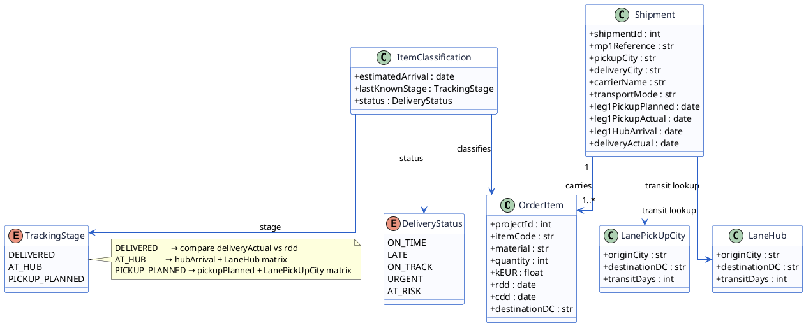
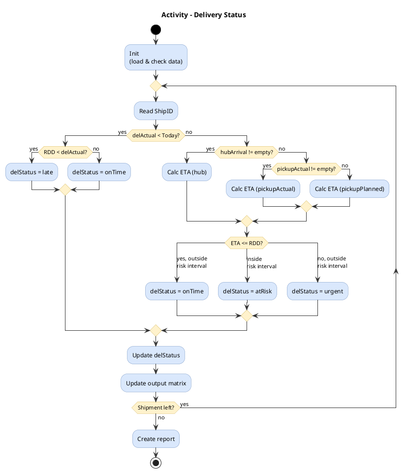
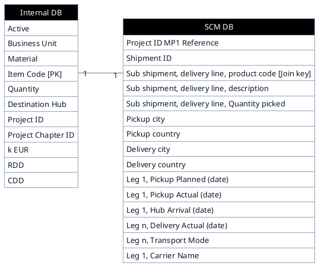

# Project design

The project is structured around six components: four data classes that represent the input and lookup data, one classification class that holds the output, and two enumerations that constrain the possible values of the classification result.

UML diagrams provided in a `plantuml` block are automatically rendered when the
documentation is built. You can find the PlantUML documentation [here](https://plantuml.com/).

---

# Components (Class Diagram)

## Components and responsibilities

OrderItem represents a single line item from the internal order management database. It holds the item's identity, quantity, financial value, destination distribution centre, and the two key dates the programme works against: the Required Delivery Date (RDD) and the Customer Desired Date (CDD). Each order item is the primary unit being tracked.

Shipment represents the logistics record from the external SCM system. It captures where an item is being collected from, where it is going, and the three milestone dates that record how far along in transit the shipment has progressed: the planned pickup date, the actual pickup date, the hub arrival date, and the actual delivery date.

LanePickUpCity is a lookup table that maps origin cities to destination distribution centers with an associated transit time in days. It is used when the last known milestone is the planned pickup date, meaning the item has not yet been collected and the full journey time must be estimated.

LaneHub is a second lookup table with the same structure, used when the item has already arrived at an intermediate hub. In this case only the remaining leg, from the hub to the destination distribution center, needs to be estimated, and this matrix provides that transit time.

ItemClassification is the output produced for each order item after the programme has determined its tracking stage and run the appropriate calculation. It stores the estimated or actual arrival date, the stage at which the item was found, and the resulting delivery status.

The enumerations TrackingStage and DeliveryStatus constrain the possible outcomes. TrackingStage has three values: DELIVERED, AT_HUB, and PICKUP_PLANNED, corresponding to the three branches of the classification logic. DeliveryStatus has five values: ON_TIME and LATE apply only to delivered items, while ON_TRACK, URGENT, and AT_RISK apply to items still in transit.

## Components and responsibilities

The program begins by joining each OrderItem to its corresponding Shipment via the projectID. Once joined, it inspects the shipment's milestone dates in order of priority to determine the TrackingStage. If a delivery actual date is present, the stage is DELIVERED and the actual date is compared directly against the RDD. If only a hub arrival date is available, the stage is AT_HUB and the LaneHub matrix is used to estimate the remaining transit time. If only a planned pickup date is available, the stage is PICKUP_PLANNED and the LanePickUpCity matrix is used to estimate the full journey. In all cases the result is written into an ItemClassification record for that item.

## Data Required

The programme requires four input sources: the internal order database containing the OrderItem records, the SCM extract containing the Shipment records, and the two lane transit matrices (LanePickUpCity and LaneHub) provided as lookup sheets.

## Outputs

The program produces an array with the project identification number, shipment identification number, and item number, in which every item has an assigned delivery status, an estimated date of arrival, and the tracking stage based on the classification. It also provides a summary of all active shipments, their delivery states, as well as the amount of shipments requiring immediate attention.

---

# Components (Activity Diagram)

---

# Entity Relationship Diagram (ERD)

